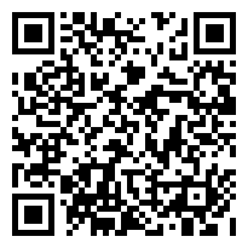
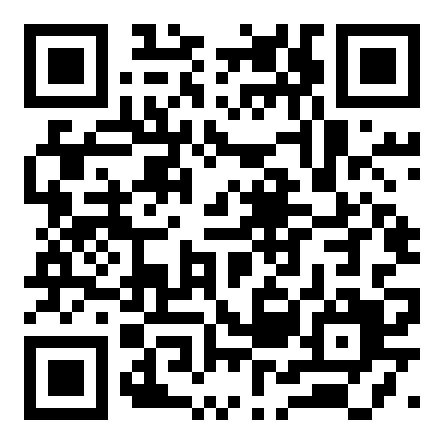

# LionOfJudo
## Professional sports science for judo clubs that could never afford it

*Sponsor & investor brief — Judo Club Niš pilot, July 2026*

---

## The story

A year ago my son Lev walked into **Judo Club Niš — the oldest judo club in
the city**. Twelve months later he took **5th at an international
tournament and 1st at the local one**, and was moved to the senior group at
age 8. His coaches say the word "Olympic" out loud.

Elite federations answer that kind of talent with sports-science labs:
multi-camera motion capture, force measurement, technique analytics —
**$10,000–50,000 per installation, plus $500+/month** to run. A club in Niš
will never have that. So I built it in my garage.

**LionOfJudo turns two ordinary cameras and ~$40 of sensors into a
professional analysis system** — technique recognition, biomechanical
skeleton tracking, and (sensor units arriving now) direct measurement of
throw power in g-force and rotation speed. It runs offline on a laptop.
It costs nothing per month. And every child's face except the analyzed
athlete's is blurred automatically, by design.

---

## What already works — today, not on slides

| Capability | Status |
|---|---|
| Automatic throw detection from wearable sensor g-spikes | ✅ software verified end-to-end |
| Two-camera sync with no cables (audio cross-correlation, <33 ms) | ✅ verified |
| 17-point skeleton tracking + biomechanics on every clip | ✅ working |
| Technique recognition: 26-waza trained classifier + 134-waza reference catalog, cross-checking each other | ✅ working |
| Automatic face blurring of every child except the analyzed athlete | ✅ working, fail-safe design |
| One-command overnight processing; morning report with per-throw clips, technique, metrics | ✅ working |
| Showcase video output (recognition panel with probabilities) | ✅ **demoed on real competition footage — 2 of 2 throws recognized correctly** (o-soto-gari, uchi-mata) |
| Wearable sensor units (ESP32 + IMU, in-gi, child-safe mounting) | 🔶 firmware compiled & tested in software; hardware parts arrive ~3 weeks |

### See it yourself — real competition footage, public links

| | |
|---|---|
| **O-soto-gari, recognized at 52%** (catalog cross-check agrees, 0.95) | [youtube.com/shorts/LzWIkl6T21w](https://youtube.com/shorts/LzWIkl6T21w) |
| **Uchi-mata, recognized correctly** | [youtu.be/B9TNP2kZUlI](https://youtu.be/B9TNP2kZUlI) |

 

*Scan either code. Every spectator's and child's face was blurred
automatically — no editor touched these videos.*

**Validation.** The demo was reviewed by five Judo Club Niš trainers,
judoka and judges: **Marko Radulović, Stevan Vukadinović, Vladimir
Spasić, Uroš Kostadinović, and Dragan Spasić — former national trainer
of the Serbian team**. Outcome: the club committed **two young judokas —
one of them Serbia's #1 in U14 — as pilot athletes** to build the
training dataset.

---

## The market today — and the gap we fill

Judo is one of the most practiced sports on the planet: **20–40 million
practitioners** (IJF figures) organized under **205 national federations
across all five continents** — an Olympic sport since 1964, and in many
countries a default childhood sport taught in schools. The overwhelming
majority of those millions train in ordinary clubs like ours, coached by
trainers who have never had a single instrument beyond their own eyes.
That — not the handful of national-team labs — is the market.

Every existing option fails that ordinary trainer on price, on precision,
or on both:

| Solution | Real cost | What an ordinary judo trainer gets |
|---|---|---|
| Optical mocap labs (Vicon, Motion Analysis) | **$20,000–250,000+** install, plus $3,000–6,000/yr software | Nothing — these live in federation labs and universities, not clubs |
| Inertial mocap suits (Movella/Xsens MVN) | **~$4,600 hardware + $3,800/yr** software; real total 3–5× sticker | Full-body suit per athlete — impractical on a tatami, unaffordable at club scale |
| Video analysis platforms (Dartfish, Hudl) | $140–1,000+/yr per coach, quote-based for clubs | Manual tagging and slow-motion drawing — the coach still does all the analysis by hand; **no automatic technique recognition, no force measurement** |
| Academic IMU research (taekwondo, gymnastics, basketball action recognition, 90%+ accuracies) | Papers, not products | Nothing purchasable — and none of it targets judo |

**And there is a precision problem money doesn't solve:** judo evolves
fast — new grips, hybrid entries, drop variations appear at international
level every season. Two techniques can look nearly identical on video
(uchi-mata vs o-guruma, kouchi vs ouchi in a scramble). **Video-only
systems fundamentally cannot resolve them.** Our in-gi accelerometers
capture the throw's mechanical signature — impact g-force, rotation
profile, timing — which disambiguates what pixels cannot. That is the
"cheap AND precise" claim: pose AI for the shape, physics for the truth.

**Business model — for the people first, sustainable second:**
- **DIY tier — software free forever (MIT license):** a family or school
  pays only **parts at cost, ~€40 per sensor capsule** (published
  shopping list and build guide); their own laptop and cameras. This is
  the mission: every kid, every school.
- **Club kit — €1,000/year:** the club buys an outcome, not a project:
  2 dedicated cameras + tripods (~€400, year one), 4 assembled and
  tested sensor capsules (~€200), managed cloud processing & storage
  (~€200/yr), setup afternoon + trainer onboarding + support (~€200).
- **Federation tier (paid, later):** multi-club deployments, athlete
  registries, season analytics, national talent-scouting dashboards —
  priced against the $20k+ lab alternatives they currently can't afford
  at scale.

The free tier is not charity against the paid tiers — it is the funnel
and the dataset engine. Every DIY club that adopts it makes the
recognition models better for everyone.

## Why this is hard to copy

1. **The dataset nobody else has.** Generic AI knows what judo looks like
   on YouTube. Ours is being trained on Serbian competition youth —
   kid-sized bodies, real resistance, real referees — labeled by the
   trainers who coach them. Every training session automatically produces
   new labeled data; the system gets smarter every week the club uses it.
2. **Measured power, not estimated.** In-gi accelerometers give actual
   impact g-force and hip rotation speed per throw. No video-only system
   can produce "6.2 g impact, 420°/s rotation — 15% more than last month."
3. **Privacy as architecture, not policy.** Blur-by-default with a single
   confirmed athlete exempted; the failure mode over-blurs, never exposes.
   This is what lets a club legally and ethically film children's training.
4. **Cost structure that scales to poor clubs.** ~$40 of sensors per
   athlete kit, cameras the club already owns, zero cloud costs. A
   national federation could equip fifty clubs for the price of one
   commercial installation.

---

## The full roadmap — funded once, nine months, five stages

*(The software is finished and verified; the trainers are committed; the
timeline starts the day parts arrive.)*

**Phase 1 — Units live + instrumented pilot** *(weeks 1–6)*
- Weeks 1–2: assemble & bench-test sensor units; garage dress rehearsal
  with Lev (that's the story we film)
- Weeks 2–6: instrumented sessions at Judo Club Niš with the 2 pilot
  athletes; first reports with **measured throw power** to the trainers

**Phase 2 — Dataset & accuracy sprint** *(weeks 4–10, overlaps)*
- Trainers label competition/training footage with a one-keypress tool
  (no technical skill needed) — five experts labeling their own athletes
  out-produces any internet scraping
- Held-out evaluation on real competition footage after every retrain
- Target: 50+ labeled repetitions per technique for the pilot athletes'
  competition repertoire → recognition on *our* athletes reaches
  production grade

**Phase 3 — The trainer product** *(months 3–5)*
- **Per-athlete progress dashboard**: technique quality trend, power trend
  (g-force / rotation per waza over the season), session-to-session and
  training-vs-competition comparison
- **Technique quality scoring**: trainer-labeled good/needs-work examples
  teach the system to explain *why* — hip height, entry timing, kuzushi —
  turning it from a recorder into an assistant coach
- **Per-waza power signatures** from the IMU data: each throw's
  acceleration profile compared against the athlete's own best
- Serbian-language reports; PDF exports for parents (a club revenue
  opportunity)
- Sensor kits for 5+ athletes

**Phase 4 — Ne-waza (ground work) + next-generation model** *(months 4–7)*
- Ground-work segmentation and recognition (the 48-hold catalog is already
  in the reference bank; ne-waza needs its own detection logic)
- Upgrade the classifier to a temporal neural network trained on the
  pose sequences the pipeline already stores — the architecture step that
  historically doubles accuracy once a corpus matures
- Optional vision-LLM assist for rare techniques

**Phase 5 — Beyond one club** *(months 5–9)*
- Packaged replication kit: sensors, mounting, software image, setup guide
  — any club can deploy in an afternoon
- Pilot #2 at a second Serbian club
- Federation conversation with a season of measured results in hand
- Publication of pilot results (methodology + anonymized data) — the
  academic credibility that opens federation and EU sport-fund doors

---

## The ask — one number, one time

**Skin in the game first:** I have already funded discovery myself —
**over $1,000 in parts, equipment and spares, and 300+ hours of my
professional time**. At my market rate as an AI product executive that
is **€50,000+ already invested**. The exploration risk is spent and paid
for. What I'm raising now buys **execution of a proven system**, not
experiments.

### €30,000 for the full nine-month program

| Line | € | Covers |
|---|---|---|
| Sensor & camera hardware | 2,500 | 10 athlete sensor kits + spares, 2 dedicated cameras + tripods, mounting materials |
| Club processing station + cloud storage | 2,000 | Machine living at the club — overnight processing without my laptop; managed storage |
| Development time | 15,000 | 9 months focused work: dashboard, quality scoring, ne-waza, neural model |
| Trainer collaboration | 3,500 | Labeling sessions, filming sessions, competition travel for data collection |
| Second-club rollout + localization | 2,000 | Kit for pilot club #2, Serbian localization, printed materials |
| Replication-kit productization | 3,000 | Capsule mold, assembly documentation, child-safety testing |
| Contingency | 2,000 | Broken sensors, reshoots, the unglamorous reality of hardware |

**The backer's terms:** backing the program now guarantees a **25%
discount at the pre-seed round when LionOfJudo enters its commercial
stage**. You are not donating — you are first in line.

The software stays **open source (MIT) and $0/month by design** — every
euro goes to hardware, people, and time, not licenses or cloud bills.

---

## The honest state of the numbers

We show sponsors the same numbers we use internally:

- Technique recognition today: 26 trained techniques; on the live
  competition demo it went **2/2 with the reference catalog agreeing**.
  Across the full corpus the honest cross-validated baseline is ~23%
  top-1 over 26 classes (chance = 4%) — trained mostly on heterogeneous
  internet instructionals. This number is the *floor*: accuracy follows
  data, and the pilot generates exactly the right data (our athletes,
  our cameras, trainer-labeled). Phases 2 and 4 exist precisely to move it.
- The physics does not need training: skeleton tracking, sync, face
  blurring, and (with sensors) g-force/rotation measurement work today
  at production quality.

---

## Who

**Pavel Dudko — founder.**
20 years in machine learning. Co-founder & Head of Product and Data
Science at **ZENPULSAR** (London) — an AI company processing billions of
social-media data points in real time for hedge funds and commodity
traders; graduate of **Google AI First 2023**. Previously founded three
startups (two accelerated — Bolt/Spain, Metavallon/Greece; one revenue-
generating for 5 years), Manager of Corporate Strategy at **PwC**.
MSc Mathematics & Computer Science, **Lomonosov Moscow State University**.
Published ML researcher (Springer, 2024 & 2025). Based in Niš.
LinkedIn: [linkedin.com/in/pavel-dudko-969ba659](https://www.linkedin.com/in/pavel-dudko-969ba659/)
· pavel.dudko@gmail.com · +381 63 773 81 79

This is not a hobbyist learning AI on his kid — it is a professional AI
product builder pointing two decades of experience at his son's sport.

**Dr Milan Zdravković — scientific consultant.**
Associate professor of applied AI at the **Faculty of Mechanical
Engineering, University of Niš**; speaker at the OECD Global Partnership
on AI Summit (Serbia, 2024). Pavel's research collaborator at ZENPULSAR
and co-author — **two joint Springer publications (2024 and 2025)** on
machine learning over social-media signals for financial markets.
Directly relevant track record: conceived and developed a **phone-based
skiing accelerometer analysis app** — his idea, the same
IMU-motion-analysis approach LionOfJudo brings to the tatami, already
proven on the slopes. A University of Niš professor on a Niš
club's pilot also opens the door to student projects and academic
publication of the pilot's results.
LinkedIn: [linkedin.com/in/milanzdravkovic](https://www.linkedin.com/in/milanzdravkovic)

**Judo Club Niš — pilot club.** The oldest judo club in the city. Five
collaborating trainers and judges including a former Serbian national
team trainer; two committed pilot athletes including Serbia's #1 U14.

**The first user** — Lev, 8 years old, 5th internationally and 1st
locally after a single year of judo, whose father refuses to let talent
be limited by a club's budget.

---

*Repository: github.com/pashadude/LionOfJudo — MIT license.
Built with love for judo and kids who deserve better training tools.*
